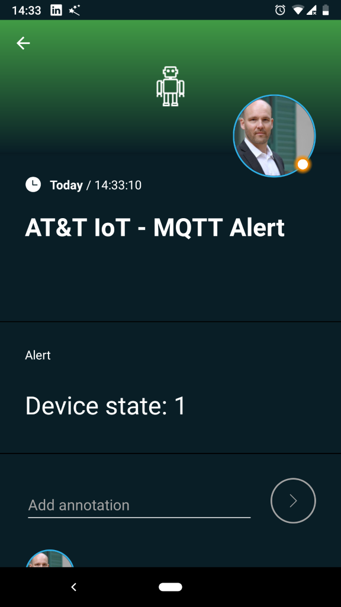
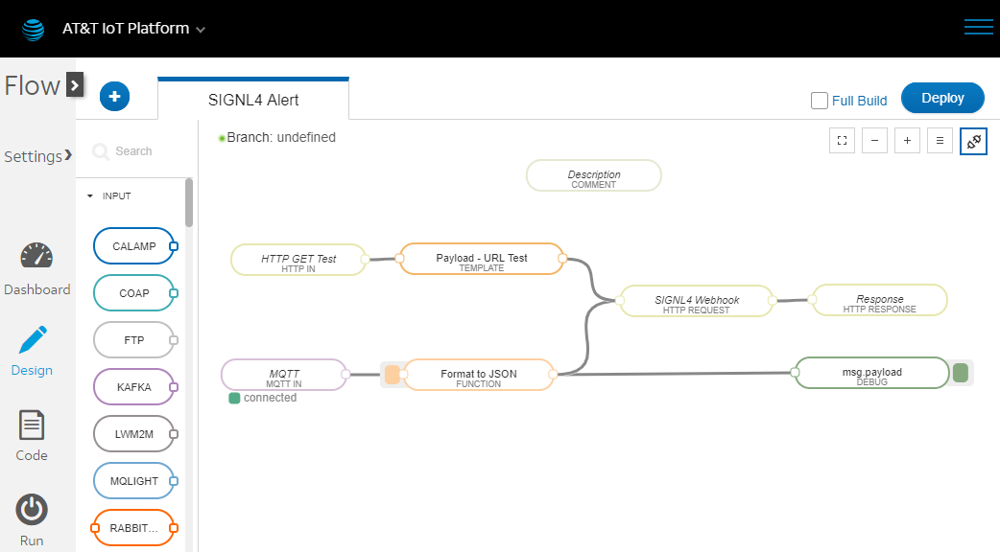
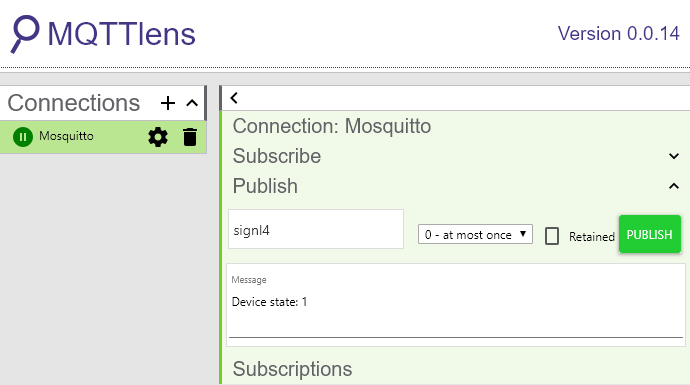

# Integrating SIGNL4 with the AT&T IoT Platform

Mobile alerting with tracking & escalation for the AT&T IoT Platform using MQTT.

## Why SIGNL4

The AT&T IoT Platform provides a scalable, rapid solution development platform, made up of tightly integrated components that can be customized to help you solve your business challenges. Whether you are collecting data from a Raspberry Pi or industrial machines, the platform can help you manage your IoT devices in real time. Pairing this powerful IoT platform with SIGNL4 can enhance your daily operations with an extension to your mobile team in the field or on the shop floor.

## How it Works

All it takes to pair the AT&T IoT Platform and SIGNL4 is a flow that implements a webhook and encapsulates the SIGNL4 alerting capabilities.

## Integration Capabilities

- Service engineers alerted via mobile push, text and voice
- Staff can acknowledge and take ownership for critical events that occur
- Alerts are escalated in case of no response
- Communicate within an alert to address a particular problem
- Alert on critical device states
- Two-way integration to interact or set the device state

## Scenarios

- Industrial IoT
- Industry 4.0
- IoT Service Alerting
- IoT Device Management
- Manufacturing, Utility, Oil and Gas, Agriculture, etc.

## How To Integrate

### Integrating SIGNL4 with the AT&T IoT Platform

Gathering events from IoT devices and sending team alerts in case of critical incidents is a broad field. It starts with simple prototypes using a Raspberry Pi and goes up to industrial IoT scenarios, machine data or distributed systems in the field.

SIGNL4 is a mobile alert notification app for powerful alerting, alert management and mobile assignment of work items. Get the app at https://www.signl4.com.

The AT&T IoT Platform provides a scalable, rapid solution development platform to help you solve your business challenges. The integration with SIGNL4 is straightforward. In the following we will show an example on how to send alert notifications using SIGNL4 in case of MQTT events coming from devices in the field.

### Prerequisites

A SIGNL4 (https://www.signl4.com) account

A account on the AT&T IoT Platform (https://iotplatform.att.com and https://console.iot.att.com)

An MQTT Broker (optional, we used the free one at https://test.mosquitto.org for the test)

An MQTT client simulator (optional, we used MQTTLense at https://chrome.google.com/webstore/detail/mqttlens/hemojaaeigabkbcookmlgmdigohjobjm)

#### Integration Steps

1. Create the Flow
Go to the Flow dashboard at the AT&T IoT Platform at https://flow.att.io. Here you can create a new flow.

We have created the following nodes:

HTTP GET Test: This provides you with a custom URL for easy testing in a browser.

Payload – URL Test: When the above URL was called this node is triggered and just set a static text to be sent to SIGNL4.

MQTT: This MQTT node connects to an MQTT broker in our case we just used the free one available at https://test.mosquitto.org. When an MQTT message arrives this node triggers and provided the data to the next one.

Format to JSON: We use a function to format the MQTT message into a nice JSON format to be processed by SIGNL4.

SIGNL4 Webhook: Here we go. This is our SIGNL4 webhook. https://flow.att.io/explore. Just search for SIGNL4 here.

2. Test the Flow

The easiest way to test the above flow is to use the HTTP GET URL and enter it into your browser. This will trigger the flow and as a result you will get back the SIGNL4 eventID.

If you would like to test the MQTT part as well you might want to use the MQTT test client MQTTLense available at https://chrome.google.com/webstore/detail/mqttlens/hemojaaeigabkbcookmlgmdigohjobjm. You can connect this one to the MQTT broker, which in our case is Mosquitto at https://test.mosquitto.org. With MQTTLense you can just publish a message with a matching topic, in our case “signl4”.

3. Adapt the Flow
Now you just need to adapt the flow to your needs or copy the SIGNL4 node to your own flows whenever you need reliable alerting to mobile teams. That is it.
 

 

 

 

 

 

 

 

 

 

 

Adapt the Flow
Now you just need to adapt the flow to your needs or copy the SIGNL4 node to your own flows whenever you need reliable alerting to mobile teams. That is it.